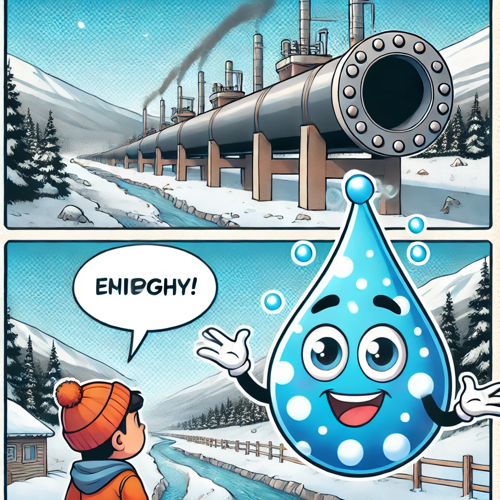
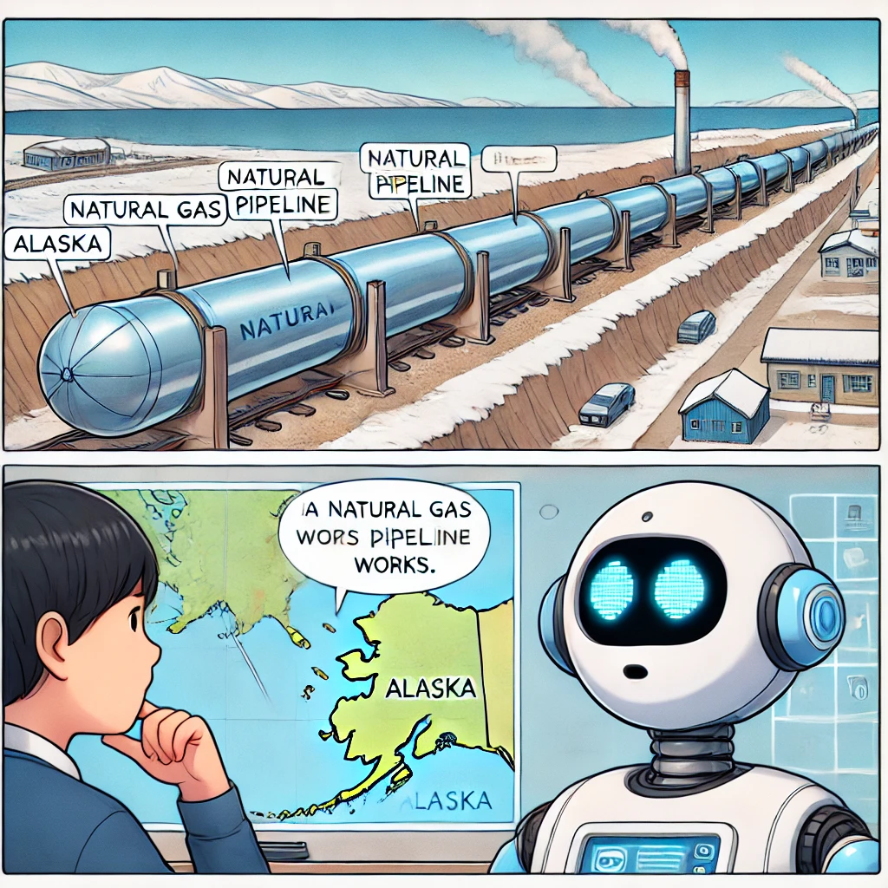
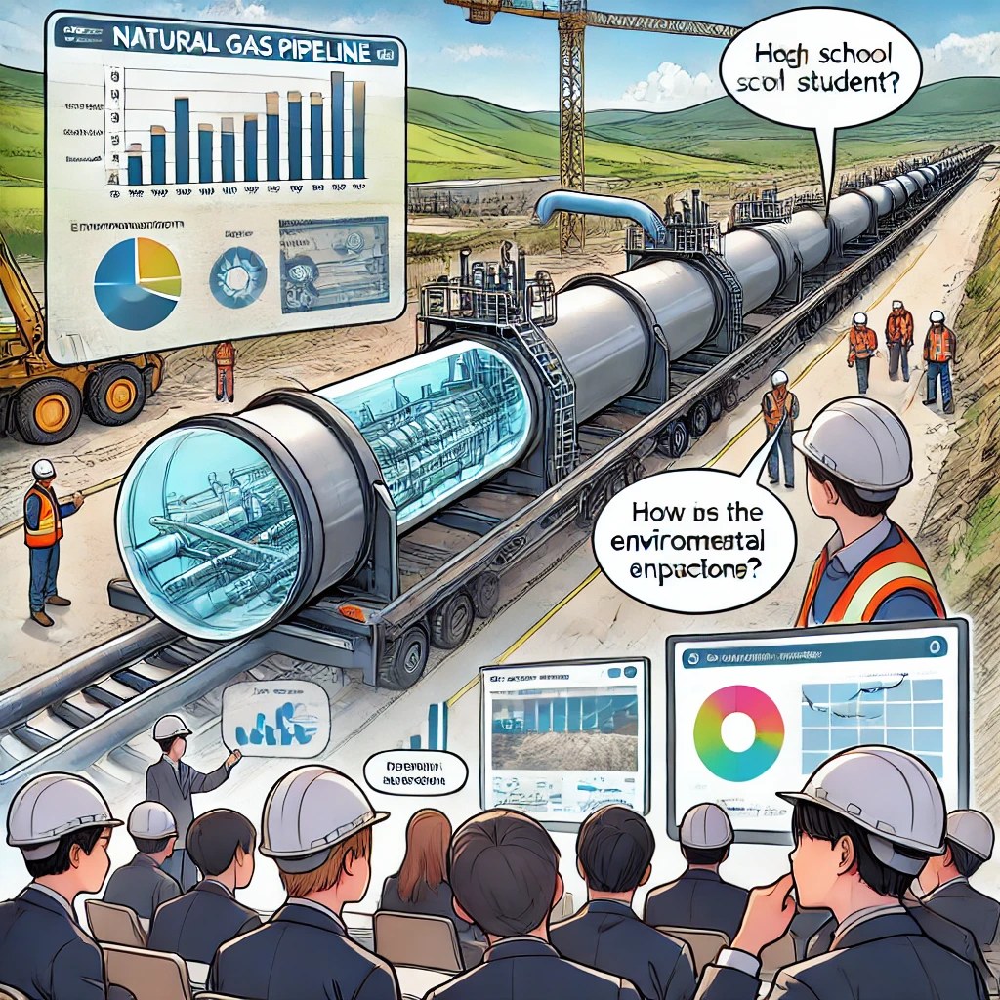

# 학습 내용

일주일간 아래와 같은 내용을 학습했습니다.

## MSA

1. MSA 프로토타입 설계
   - API Gateway
   - BFF (Back For Front)
   - services
2. MSA 트랜잭션 보장
   - 네트워크 통신에서의 트랜잭션 보장
   - 정합성
   - 이벤트를 활용한 데이터 보장
   - 멱등성
   - 대사 작업
3. 로컬 캐싱
   - 서비스별 캐싱 (EHCache)
   - 로컬캐싱 동기화하는 것이 안티패턴
4. 데이터 일괄조회
   - MSA에서 API로 데이터를 조회하면 JPA N+1과 비슷한 문제가 발생
   - 데이터 단건 조회보다 일괄조회가 바람직
   - 50메가가 넘어가는 정도의 데이터 조회면 파일로 다운하는 것이 더 효과적적

## KNN

1. anaconda 환경 설게
2. Django 배포 방식
3. 데이터 전처리
   - 데이터 가공
   - numpy를 활용한 matrix 생성
4. 학습을 통한 추천
   - KNN 알고리즘을 통해 similarity matrix 생성
   - matrix 기반 추천

 
 
 

# 작업

이번주는 서비스 아이디어 도출에 집중하였습니다.

1. 아이디어 회의
2. Jira 기획 부분 작성

 
 
 

# 아이디어 기획

## 1. 뉴스 웹툰화 서비스스

### **📌 서비스 개요**

어린이와 청소년이 뉴스에 자연스럽게 관심을 가질 수 있도록, **AI가 뉴스를 쉽고 재미있게 요약하여 제공하는 서비스**입니다.

단순한 뉴스 제공이 아닌, **웹툰, 게임화 요소**를 활용해 어린이와 청소년이 뉴스에 친숙해지도록 설계되었습니다.

이를 통해 **미디어 리터러시를 키우고, 비판적 사고력을 기르며, 시사에 대한 관심을 유도하는 것**이 목표입니다.

### 유사 서비스

https://www.chosun.com/kid/

### **🎯 주요 기능**

#### **1. AI 뉴스 요약 (연령별 맞춤 제공)**

- AI가 최신 뉴스를 분석하여 **연령대별 난이도 조절**
  - **초등학생:** 3줄 요약 + 그림 설명
  - **중학생:** 5줄 요약 + 쉬운 단어 정리
  - **고등학생 이상:** 10줄 요약 + 핵심 개념 정리
- 어려운 개념을 **쉽고 친숙한 표현**으로 변환
  - 예: “GDP 성장률” → “나라의 돈이 얼마나 늘어났는지”

#### **2. 스토리텔링 & 웹툰 뉴스**

- 뉴스 속 등장인물을 AI가 캐릭터화하여 **웹툰형식**으로 제공
- 예시

  https://www.hani.co.kr/arti/international/america/1185381.html

  ### **🔹 초등학생용 (3줄 요약 + 쉬운 설명)**

  

  - 미국이 알래스카에서 **커다란 길(긴 관)**을 만들려고 해요.
  - 이 길을 따라 **특별한 기체(천연가스)가 다른 곳으로 이동**할 거예요.
  - 한국과 일본이 이 프로젝트에 **많은 돈을 투자하려고 해요.**

  👉 **(추가 설명)**

  _"천연가스는 우리가 집을 따뜻하게 하거나 전기를 만드는 데 쓰이는 특별한 기체예요. 이 기체가 아주 긴 빨대 같은 길(관)을 타고 멀리까지 이동할 수 있도록 만드는 거예요!"_

  ### **🔹 중학생용 (5줄 요약 + 용어 + 쉬운 설명 혼합)**

  

  - 미국이 알래스카에서 **천연가스를 멀리 보내는 파이프라인(길처럼 생긴 거대한 관)**을 만들려고 해요.
  - 이 파이프라인을 통해 **천연가스를 빠르고 효율적으로 운반**할 수 있어요.
  - 한국과 일본을 포함한 여러 나라가 **이 프로젝트에 많은 돈을 투자할 계획**이에요.
  - 천연가스는 **전기 생산과 난방 등에 쓰이는 중요한 에너지원**이에요.
  - 이 파이프라인이 완성되면 **에너지 산업과 경제에 큰 도움이 될 것**으로 기대돼요.

  👉 **(추가 설명)**

  _"파이프라인은 물이 수도관을 통해 이동하는 것처럼, 천연가스를 아주 긴 관을 통해 멀리까지 보내는 시스템이에요!"_

  ### **🔹 고등학생용 (10줄 요약 + 기존 방식 유지)**

  

  - 미국은 알래스카에서 **천연가스를 효율적으로 운반하는 대규모 파이프라인**을 건설할 계획이에요.
  - 이 파이프라인은 **세계 최대 규모의 LNG(액화천연가스) 운송 시스템**이 될 것으로 예상돼요.
  - 한국과 일본을 포함한 여러 나라가 **수조 달러 규모의 투자 의사를 밝힌 상태**예요.
  - 천연가스는 **화석연료의 한 종류**로, 주로 난방과 전력 생산에 사용돼요.
  - 이 프로젝트는 **미국의 에너지 산업 발전과 경제 활성화에 기여할 것으로 기대**돼요.
  - 하지만 대규모 인프라 사업인 만큼 **환경 영향 평가와 원주민 보호 문제**가 중요한 논점이에요.
  - 환경 단체들은 **생태계 파괴와 온실가스 배출 증가 가능성**을 우려하고 있어요.
  - 또한, 국제 에너지 시장에서 **천연가스 수요와 가격 변동이 프로젝트 경제성에 영향을 줄 수 있어요.**
  - 트럼프 대통령은 이 프로젝트를 **"정말 장관이 될 것"**이라며 기대감을 나타냈어요.
  - 이런 대규모 프로젝트는 **경제적 이익과 환경 문제를 균형 있게 고려해야 해요.**

#### **3. AI 뉴스 퀴즈 & 게임 (게이미피케이션)**

- 뉴스를 본 후 AI가 퀴즈를 내고, 맞추면 포인트 지급
- 예: “환경 문제 뉴스” → “탄소 배출을 줄이려면 어떻게 해야 할까요?”
- 퀴즈 성공 시 **배지 획득 & 캐릭터 성장 (게임 요소 추가)**
- 게임 요소를 넣어 뉴스에 대한 관심도 상승
  - 킬링타임 게임 내에 퀴즈를 넣어서 즐길 수 있게 제작
    

#### **5. 친구들과 뉴스 경쟁 & 소셜 요소**

- **“오늘 3개 뉴스를 읽었어요! 친구보다 2개 더 많아요!”** 같은 피드백 제공
- 뉴스 토론 게시판에서 **또래들과 의견 교환** 가능

#### 6. 기사 작성 도우미 (어린이 기자단)

- 어린이 기자단과 같은 활동 AI 지원

#### **7. 부모 & 선생님 모드**

- 아이가 본 뉴스 리포트 제공
- 학습 진도 & 관심 분야 분석 리포트 제공
- 난이도 자동 조절 가능 (예: “우리 아이에게 맞춤 난이도 설정”)

---

### 🫵🏻추천 기능

#### 1. 개인 맞춤형 뉴스 추천

#### 2. 같은 연령대 (레벨) 이슈 추천

#### 3. 자주 틀리는 퀴즈 관련 뉴스 추천

#### 4. 국가별 지역별 뉴스 추천 (지도로 보여주기)

---

### **📊 데이터 활용**

#### **1. AI 뉴스 요약 데이터**

- 뉴스 기사 텍스트를 AI가 분석하여 **어린이·청소년용 문장 변환**
- 자연어 처리(NLP) 기반으로 **어려운 개념을 쉬운 언어로 바꿈**

#### **2. 사용자 맞춤형 추천**

- 사용자가 읽은 뉴스, 좋아하는 분야를 분석하여 맞춤 뉴스 추천
- 연령·흥미 기반 추천 (예: 스포츠 좋아하는 아이에게 축구 뉴스 추천)

#### **3. 감정 및 반응 분석**

- AI가 뉴스 퀴즈 및 토론 반응을 분석하여 **어떤 유형의 뉴스를 좋아하는지 학습**
- 감정 분석을 통해 뉴스 추천 방식 최적화

### **🚀 기대 효과**

✅ **어린이와 청소년이 자연스럽게 뉴스에 관심을 갖게 됨**
✅ **어려운 시사 이슈도 쉽게 이해 가능**
✅ **비판적 사고 및 미디어 리터러시 향상**
✅ **게임 요소를 활용하여 자발적인 뉴스 학습 유도**
✅ **부모와 선생님이 교육적으로 활용 가능**

### **💰 비즈니스 모델 (BM)**

💰 **기본 무료, 추가 기능 유료 (프리미엄 구독제)**

- 무료 버전: AI 뉴스 요약 & 기본 퀴즈 제공
- 프리미엄 플랜 (월 구독):
  - 더 많은 뉴스 카테고리 제공
  - AI 뉴스 토론 기능 활성화
  - 부모 & 선생님 분석 리포트 제공

💰 **B2B 교육 기관 대상 라이선스 판매**

- 학교, 도서관, 학원에서 뉴스 학습 자료로 활용

### **🛠 기술 스택**

- **AI 뉴스 요약**: GPT 기반 자연어 처리 모델
- **음성 대화형 AI**: TTS + STT(음성 변환) 기술 활용
- **웹 & 앱 개발**: React (프론트엔드) + Firebase (백엔드)
- **데이터 분석**: Python, Pandas 기반 사용자 데이터 학습

### **📌 결론**

👉 **어린이와 청소년이 뉴스에 자연스럽게 관심을 가질 수 있도록, 쉽고 재미있게 제공하는 AI 뉴스 학습 서비스!**
👉 **게임처럼 즐기면서 시사에 대한 이해도와 비판적 사고를 키울 수 있도록 설계!**

---

## 2. 식물 관리 서비스

### 개요

반려 식물과 플랜테리어에 관심을 가지는 사람이 많아지면서 실내에서 식물을 키우는 가구들이 증가하고 있습니다.

하지만 식물을 처음 키우는 사람들은 노하우가 부족하여 금방 시들거나 관리를 잘 하지 못 하는 경우가 허다합니다.

그에 따라 식물 관리에 대한 최적화를 도와주는 서비스를 생각해 보았습니다.

### 기능

1. 식물에 물주기, 분갈이, 비료 주기 알림
   - 본인이 등록해 놓은 식물 정보를 기반으로 물주기와 분갈이 주기에 맞춰 알림을 제공
   - 적절한 **물주기, 분갈이, 비료 시기 추천**
   - 식물별 **성장 단계별 관리 팁** 제공
2. 카메라를 활용한 식물 진단
   - 스마트폰 카메라로 **식물 상태를 촬영하면 AI가 분석**
   - **병충해 탐지 기능** (잎에 변색, 점이 있는지 자동 감지)
   - **영양 부족 여부 감지** (잎 색깔, 줄기 상태 분석)
   - **즉각적인 해결책 추천** ("잎이 노랗다면 질소 비료를 추가하세요!")
3. 식물을 키우는 환경에 맞는 식물 추천
   - 방의 크기, 창문 위치, 자연광 유무
   - 선호하는 식물 유형 (공기정화식물, 관엽식물, 꽃이 피는 식물 등)
   - 실내 습도 및 온도
   - 사용자의 관리 가능 수준 (초보, 중급, 전문가)
   - AR을 활용한 식물 예상 배치 제공
4. 커뮤니티 공유

### 데이터

- 📌 공공 농업 데이터 (식물별 성장 환경, 최적 온습도)
- 📌 Kaggle 식물 관리 데이터셋 활용
- 📌 SNS 트렌드 분석 (인기 있는 반려 식물 유형 파악)

---

## 3. 산책 코스 추천

### 개요

주변에 산책할 코스가 애매해요

### 기능

1. 본인이 사는 지역 주변에 산책할 만한 코스를 생성하고 추천 해줍니다.
   - 지역, 산책할 시간, 주변 공원 등의 정보를 기반으로 추천
   - 반려동물과 함께할 수 있는 코스, 경사가 적은 코스 등 맞춤형 경로 제공
   - 산책 중 주변에 카페나 맛집, 문화시설에 대한 정보 제공
2. 본인이 등록한 산책 코스들을 공유합니다.
3. 산책 코스를 함꼐 즐길 사람 매칭
4. 길에 있는 본인만의 이야기와 사진들을 공유

### 데이터

- **기존 데이터:**
  - 📌 네이버 지도 API, 구글 맵 데이터 활용
  - 📌 공공 데이터 포털(산책로, 공원 정보)
  - 📌 기상청 API (날씨, 미세먼지 반영)
  - 📌 SNS 트렌드 분석
- **추가 활용 가능 데이터:**
  - **스마트워치 연동** (심박수, 걸음 수 기록)
  - **소셜 데이터 활용** (산책 중 가장 많이 언급된 장소 파악)
